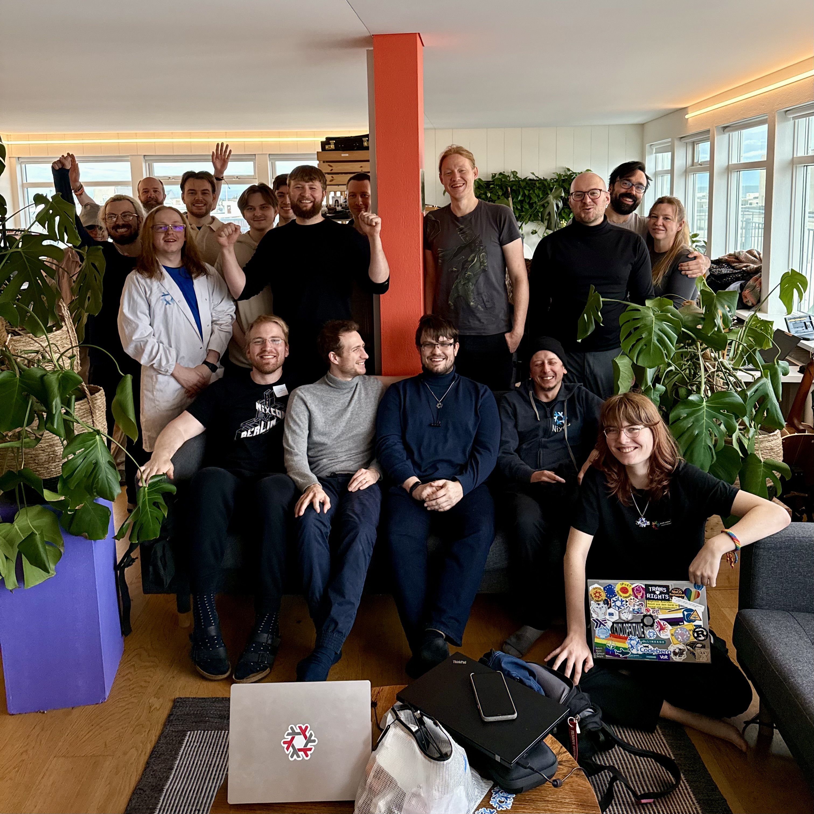

# Aurora Sprint 2026 — Summary Report

The Aurora Sprint 2026 took place February 23–27 in downtown Reykjavík, Iceland, hosted at [Genki's](https://genki.is/) office and made possible through sponsorship from [Genki](https://genki.is/), [Determinate Systems](https://determinate.systems/), and the [NixOS Foundation](https://nixos.org/community/#foundation). Around 20 Nix developers gathered from across the globe — the USA, Canada, Brazil, Finland, the UK, Germany, Ireland, Sweden, New Zealand, and Iceland — with a shared mission: advancing Nix as the ideal platform for building, developing, and testing embedded Linux systems. The sprint was held the week before [Planet Nix](https://planetnix.com/), and the week kicked off on Sunday evening with burgers and informal hacking, followed by a Monday of introductions, team formation through open discussion, and a relaxing visit to Sundhöllin swimming pool.

The core of the sprint saw an impressive breadth of technical work. Several teams pushed the boundaries of NixOS on unconventional hardware: NixOS was booted on a Sony Xperia, a Google Pixel 8, an ODROID XU4, and a ClockworkPi Uconsole with encrypted NVMe — complete with working HDMI, USB, backlight, and Ethernet. On the infrastructure and tooling side, [NixOS initrd secrets were refactored](https://github.com/NixOS/nixpkgs/pull/493445), hardware-in-the-loop CI testing was added to [buildbot-nix](https://github.com/nix-community/buildbot-nix), and the mana and finix projects saw significant usability improvements. Teams explored [adios](https://github.com/Mic92/adios-flake) as an alternative Nix-based system builder, booting an nspawn container into systemd with a Nix-built `/etc`. Other contributions included audio plugin packaging, a [libinput PR to nixpkgs](https://github.com/NixOS/nixpkgs), PKCS#11 YubiKey signing work in robotnix, and experiments with [radicle.xyz](https://radicle.xyz) and Nix flakes.

Beyond the code, the sprint fostered genuine community and collaboration. Participants shared meals — from BBQs and chickpea wraps at the office to a dinner at Forréttabarinn — explored Reykjavík, soaked in thermal baths at [Sky Lagoon](https://www.skylagoon.com), and went aurora hunting. The informal, co-located format proved invaluable: developers who had only known each other online paired up on debugging sessions, reviewed each other's pull requests in real time, and sparked new project ideas like [adios-flake](https://github.com/Mic92/adios-flake). By Friday, the week had produced a remarkable collection of upstream contributions, new tool features, and hardware breakthroughs — a testament to the productivity of in-person sprints and the generous support of sponsors [Genki](https://genki.is/), [Determinate Systems](https://determinate.systems/), and the [NixOS Foundation](https://nixos.org/community/#foundation). [Browse photos from the event](https://immich.genki.is).
